# DevOps Batch 14 — Server Monitoring, Logging & CI Pipeline

## Student Information

- **Student Name:** Md Hasan Ali
- **Batch:** DevOps Batch 14
- **Assignment Title:** Server Monitoring, Logging & CI Pipeline
- **GitHub Repository:** `https://github.com/Hasancse1617/ostad-assignement6.git`

---

## 1. Project Overview

This project implements a basic DevOps monitoring, logging, and CI environment on an Ubuntu server.

The project contains:

- **Node Exporter** for collecting Linux system metrics
- **Prometheus** for scraping and storing metrics
- **Grafana** for visualization and monitoring dashboards
- **Loki** for centralized log storage
- **Grafana Alloy** for collecting and forwarding server logs to Loki
- **GitHub Actions** for CI
- **GitHub Actions self-hosted runner** for executing the CI pipeline

The CI pipeline performs:

1. Build
2. Test
3. Artifact Generation
4. Artifact Upload

> **Note:** Deployment/CD is intentionally not included because it is not required by the assignment.

---

## 2. Architecture Diagram

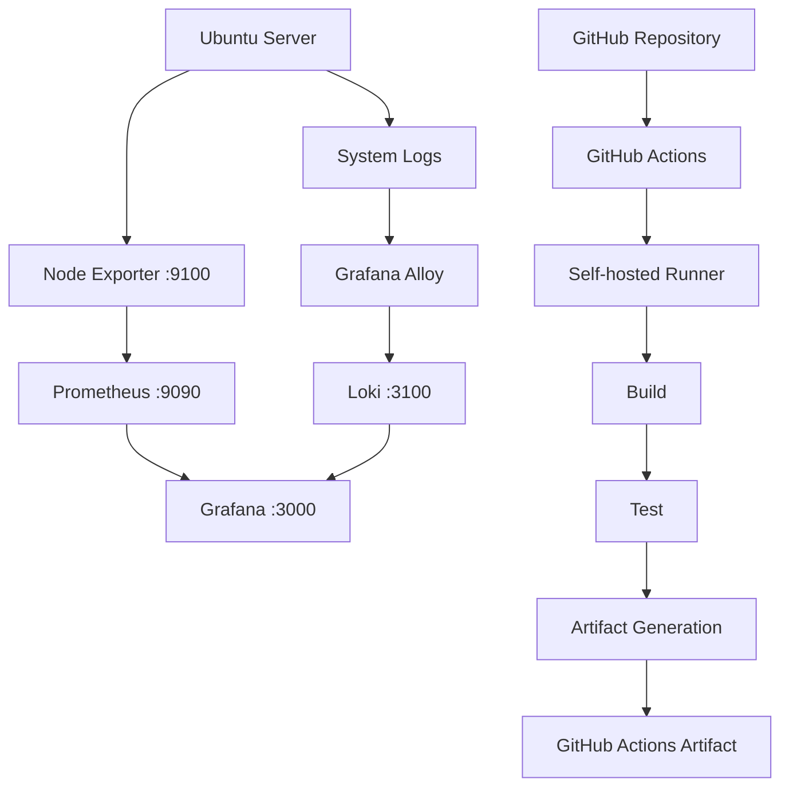

### Monitoring Flow

```text
Linux Server
     |
     v
Node Exporter
     |
     v
Prometheus
     |
     v
Grafana
```

### Logging Flow

```text
Linux Logs
    |
    v
Grafana Alloy
    |
    v
Loki
    |
    v
Grafana Explore
```

### CI Flow

```text
Git Push
   |
   v
GitHub Actions
   |
   v
Self-hosted Runner
   |
   +---- Build
   |
   +---- Test
   |
   +---- Artifact
             |
             v
      GitHub Artifact
```

---

# 3. Project Structure

```text
devops-monitoring-assignment/
│
├── .github/
│   └── workflows/
│       └── ci.yml
│
├── app/
│   ├── package.json
│   ├── index.html
│   ├── vite.config.js
│   └── src/
│       ├── main.jsx
│       ├── App.jsx
│       ├── App.css
│       └── index.css
│
├── prometheus/
│   ├── prometheus.yml
│   └── prometheus.service
│
├── node-exporter/
│   └── node-exporter.service
│
├── loki/
│   ├── loki-config.yml
│   └── loki.service
│
├── alloy/
│   ├── config.alloy
│   └── alloy.service
│
├── grafana/
│   └── dashboards/
│       └── server-monitoring-dashboard.json
│
├── screenshots/
│   ├── 01-prometheus-targets.png
│   ├── 02-prometheus-metrics.png
│   ├── 03-node-exporter-status.png
│   ├── 04-node-exporter-metrics.png
│   ├── 05-grafana-prometheus-datasource.png
│   ├── 06-grafana-monitoring-dashboard.png
│   ├── 07-grafana-loki-datasource.png
│   ├── 08-grafana-loki-logs.png
│   ├── 09-self-hosted-runner-online.png
│   ├── 10-github-actions-build-test-artifact.png
│   └── 11-github-actions-artifact.png
│
└── README.md
```

---

# 4. Software Components

| Component | Purpose | Default Port |
|---|---|---:|
| Node Exporter | Linux system metrics | `9100` |
| Prometheus | Metrics collection/storage | `9090` |
| Grafana | Monitoring visualization | `3000` |
| Loki | Log aggregation/storage | `3100` |
| Grafana Alloy | Log collection/forwarding | `12345` |
| GitHub Actions Runner | CI execution | N/A |

---

# 5. Requirements

## Server

Recommended:

- Ubuntu 22.04/24.04
- 2 GB+ RAM
- Internet access
- sudo access

## Local/Development

- Git
- Node.js 20+ or 22+
- npm

---

# 6. Installation

> The following installation is intended for the actual technical practice. Versions should be updated according to the official release available when installing.

## 6.1 Update Ubuntu

```bash
sudo apt update
sudo apt upgrade -y
```

Install basic utilities:

```bash
sudo apt install -y curl wget unzip tar git
```

---

# 7. Node Exporter

## 7.1 Create user

```bash
sudo useradd --no-create-home --shell /usr/sbin/nologin node_exporter
```

## 7.2 Download Node Exporter

Replace the version with the release you are actually using.

```bash
cd /tmp

wget https://github.com/prometheus/node_exporter/releases/download/v<VERSION>/node_exporter-<VERSION>.linux-amd64.tar.gz

tar xvf node_exporter-<VERSION>.linux-amd64.tar.gz

sudo cp node_exporter-<VERSION>.linux-amd64/node_exporter /usr/local/bin/

sudo chown node_exporter:node_exporter /usr/local/bin/node_exporter
```

## 7.3 Create systemd service

Use the file:

```text
node-exporter/node-exporter.service
```

Copy it:

```bash
sudo cp node-exporter.service /etc/systemd/system/node_exporter.service
```

Then:

```bash
sudo systemctl daemon-reload
sudo systemctl enable --now node_exporter
```

Check:

```bash
sudo systemctl status node_exporter
```

Test:

```bash
curl http://localhost:9100/metrics
```

Expected result:

```text
# HELP node_cpu_seconds_total ...
# TYPE node_cpu_seconds_total counter
...
```

---

# 8. Prometheus

## 8.1 Create Prometheus user

```bash
sudo useradd --no-create-home --shell /usr/sbin/nologin prometheus
```

Create directories:

```bash
sudo mkdir -p /etc/prometheus
sudo mkdir -p /var/lib/prometheus

sudo chown prometheus:prometheus /var/lib/prometheus
```

## 8.2 Install Prometheus

Download the version you choose from the official Prometheus release page.

Example:

```bash
cd /tmp

wget https://github.com/prometheus/prometheus/releases/download/v<VERSION>/prometheus-<VERSION>.linux-amd64.tar.gz

tar xvf prometheus-<VERSION>.linux-amd64.tar.gz
```

Copy binaries:

```bash
sudo cp prometheus-<VERSION>.linux-amd64/prometheus /usr/local/bin/
sudo cp prometheus-<VERSION>.linux-amd64/promtool /usr/local/bin/
```


Set ownership:

```bash
sudo chown -R prometheus:prometheus /etc/prometheus
sudo chown prometheus:prometheus /usr/local/bin/prometheus
sudo chown prometheus:prometheus /usr/local/bin/promtool
```

---

# 9. Prometheus Configuration

Configuration file:

```text
prometheus/prometheus.yml
```

Copy:

```bash
sudo cp prometheus.yml /etc/prometheus/prometheus.yml
sudo chown prometheus:prometheus /etc/prometheus/prometheus.yml
```

Validate:

```bash
promtool check config /etc/prometheus/prometheus.yml
```

The important scrape configuration is:

```yaml
scrape_configs:
  - job_name: "node_exporter"
    static_configs:
      - targets: ["localhost:9100"]
```

---

# 10. Prometheus systemd Service

Copy:

```bash
sudo cp prometheus.service /etc/systemd/system/prometheus.service
```

Then:

```bash
sudo systemctl daemon-reload
sudo systemctl enable --now prometheus
```

Check:

```bash
sudo systemctl status prometheus
```

Open:

```text
http://SERVER_IP:9090
```

Go to:

```text
Status → Targets
```

The Node Exporter target should show:

```text
UP
```

---

# 11. Prometheus Metrics Verification

Open:

```text
http://SERVER_IP:9090
```

Try queries such as:

```promql
up
```

```promql
node_cpu_seconds_total
```

```promql
node_memory_MemAvailable_bytes
```

```promql
node_filesystem_avail_bytes
```

```promql
node_network_receive_bytes_total
```

---

# 12. Grafana

Install Grafana manually using the official repository/package method.

After installation:

```bash
sudo systemctl enable --now grafana-server
```

Check:

```bash
sudo systemctl status grafana-server
```

Open:

```text
http://SERVER_IP:3000
```

---

# 13. Grafana Prometheus Datasource

In Grafana:

```text
Connections
    ↓
Data Sources
    ↓
Add data source
    ↓
Prometheus
```

Prometheus URL:

```text
http://localhost:9090
```

Click:

```text
Save & Test
```

Expected:

```text
Successfully queried the Prometheus API.
```

---

# 14. Monitoring Dashboard

Create a dashboard containing at least:

### CPU Usage

Example PromQL:

```promql
100 - (avg by (instance) (rate(node_cpu_seconds_total{mode="idle"}[5m])) * 100)
```

### Memory Usage

```promql
100 * (1 - node_memory_MemAvailable_bytes / node_memory_MemTotal_bytes)
```

### Disk Usage

```promql
100 * (1 - node_filesystem_avail_bytes{fstype!~"tmpfs|overlay"} / node_filesystem_size_bytes{fstype!~"tmpfs|overlay"})
```

### Network Receive

```promql
rate(node_network_receive_bytes_total{device!="lo"}[5m])
```

### Network Transmit

```promql
rate(node_network_transmit_bytes_total{device!="lo"}[5m])
```

Save the dashboard.

A dashboard JSON placeholder is included in:

```text
grafana/dashboards/server-monitoring-dashboard.json
```

After creating the real dashboard, export it from Grafana and replace this placeholder JSON.

---

# 15. Loki

Create a Loki user:

```bash
sudo useradd --system --no-create-home --shell /usr/sbin/nologin loki
```

Create directories:

```bash
sudo mkdir -p /etc/loki
sudo mkdir -p /var/lib/loki

sudo chown -R loki:loki /etc/loki
sudo chown -R loki:loki /var/lib/loki
```

Download the Loki binary from the official Grafana Loki release.

Example:

```bash
wget https://github.com/grafana/loki/releases/download/v<VERSION>/loki-linux-amd64.zip

unzip loki-linux-amd64.zip

sudo mv loki-linux-amd64 /usr/local/bin/loki
sudo chmod +x /usr/local/bin/loki
```

---

# 16. Loki Configuration

Configuration:

```text
loki/loki-config.yml
```

Copy:

```bash
sudo cp loki-config.yml /etc/loki/config.yml
sudo chown loki:loki /etc/loki/config.yml
```

Copy service:

```bash
sudo cp loki.service /etc/systemd/system/loki.service
```

Start:

```bash
sudo systemctl daemon-reload
sudo systemctl enable --now loki
```

Check:

```bash
sudo systemctl status loki
```

Loki readiness endpoint:

```bash
curl http://localhost:3100/ready
```

Expected:

```text
ready
```

---

# 17. Log Collection with Grafana Alloy

Loki stores logs, but another component must collect/read log files and send them to Loki.

This project uses **Grafana Alloy** as the log collector.

Typical sources:

```text
/var/log/syslog
/var/log/auth.log
```

Configuration:

```text
alloy/config.alloy
```

Install Alloy using the official Grafana installation method.

Then copy:

```bash
sudo cp config.alloy /etc/alloy/config.alloy
```

Copy service:

```bash
sudo cp alloy.service /etc/systemd/system/alloy.service
```

Start:

```bash
sudo systemctl daemon-reload
sudo systemctl enable --now alloy
```

Check:

```bash
sudo systemctl status alloy
```

> Depending on the Alloy release, the systemd unit and configuration path supplied by the official package may differ. Use the official package's service definition when it is available.

---

# 18. Grafana Loki Datasource

In Grafana:

```text
Connections
    ↓
Data Sources
    ↓
Add data source
    ↓
Loki
```

URL:

```text
http://localhost:3100
```

Click:

```text
Save & Test
```

Expected successful connection.

---

# 19. View Logs in Grafana

Open:

```text
Explore
```

Select:

```text
Loki
```

Example LogQL:

```logql
{job="syslog"}
```

Or:

```logql
{job="auth"}
```

Generate a test log if required:

```bash
logger "DevOps Batch 14 Loki test log"
```

Then search for it in Grafana Explore.

---

# 20. GitHub Actions Self-hosted Runner

Create a self-hosted runner from:

```text
GitHub Repository
    ↓
Settings
    ↓
Actions
    ↓
Runners
    ↓
New self-hosted runner
```

Select:

```text
Linux
x64
```

Follow the commands generated by GitHub.

The runner name should be:

```text
ostad-runner
```

Verify on the server:

```bash
./run.sh
```

For persistent service, follow GitHub's recommended service installation for the runner.

GitHub should show:

```text
ostad-runner
Online
```

---

# 21. CI Pipeline

Workflow:

```text
.github/workflows/ci.yml
```

The workflow performs:

```text
Build
  ↓
Test
  ↓
Artifact Generation
  ↓
Artifact Upload
```

The workflow uses:

```yaml
runs-on: self-hosted
```

No deployment is included.

---

# 22. Local Application

The sample application is inside:

```text
app/
```

Install dependencies:

```bash
cd app
npm install
```

Build:

```bash
npm run build
```

Test:

```bash
npm test
```

The generated build output is:

```text
app/dist/
```

---

# 23. Artifact

The GitHub Actions workflow uploads:

```text
app/dist/
```

as a GitHub Actions artifact.

Artifact name:

```text
build-output
```

After a successful workflow, open:

```text
GitHub
→ Actions
→ Successful workflow
→ Artifacts
```

and verify:

```text
build-output
```

---

# 24. Required Screenshots

The following screenshots will be added after completing the technical practice.

## Prometheus

### 01 — Prometheus Targets

File:

```text
screenshots/01-prometheus-targets.png
```

Required proof:

```text
Node Exporter
State: UP
```

### 02 — Prometheus Metrics

File:

```text
screenshots/02-prometheus-metrics.png
```

Show a Node Exporter query such as:

```promql
node_cpu_seconds_total
```

---

## Node Exporter

### 03 — Node Exporter Status

File:

```text
screenshots/03-node-exporter-status.png
```

Show terminal output:

```text
active (running)
```

### 04 — Node Exporter Metrics

File:

```text
screenshots/04-node-exporter-metrics.png
```

URL:

```text
http://SERVER_IP:9100/metrics
```

Show metrics such as:

```text
node_cpu_seconds_total
node_memory_*
node_filesystem_*
node_network_*
```

---

## Grafana

### 05 — Prometheus Datasource

File:

```text
screenshots/05-grafana-prometheus-datasource.png
```

Show:

```text
Prometheus
Successfully queried
```

### 06 — Monitoring Dashboard

File:

```text
screenshots/06-grafana-monitoring-dashboard.png
```

Dashboard must show:

- CPU
- Memory
- Disk
- Network

---

## Loki

### 07 — Loki Datasource

File:

```text
screenshots/07-grafana-loki-datasource.png
```

Show successful Loki connection.

### 08 — Loki Logs

File:

```text
screenshots/08-grafana-loki-logs.png
```

Show logs in Grafana Explore.

---

## GitHub Actions

### 09 — Self-hosted Runner

File:

```text
screenshots/09-self-hosted-runner-online.png
```

Show:

```text
ostad-runner
Online
```

### 10 — Successful Workflow

File:

```text
screenshots/10-github-actions-build-test-artifact.png
```

Show:

```text
Build
✓
Test
✓
Artifact Generation
✓
```

### 11 — Artifact

File:

```text
screenshots/11-github-actions-artifact.png
```

Show:

```text
build-output
```

inside the GitHub Actions Artifacts section.

---


# 25. Security

Never commit the following to GitHub:

```text
Passwords
API keys
Access tokens
SSH private keys
AWS credentials
GitHub runner registration tokens
.env files containing secrets
```

Use GitHub Secrets for sensitive CI/CD values when required.

---

# 26. Verification Checklist

Before submission verify:

### Node Exporter

```bash
systemctl is-active node_exporter
curl http://localhost:9100/metrics
```

### Prometheus

```bash
systemctl is-active prometheus
curl http://localhost:9090/-/healthy
```

Target:

```text
Node Exporter = UP
```

### Grafana

```bash
systemctl is-active grafana-server
```

Verify:

- Prometheus datasource
- CPU panel
- Memory panel
- Disk panel
- Network panel

### Loki

```bash
systemctl is-active loki
curl http://localhost:3100/ready
```

Verify:

- Loki datasource
- Logs visible in Explore

### Alloy

```bash
systemctl is-active alloy
```

Verify that logs are reaching Loki.

### GitHub Actions

Verify:

- Self-hosted runner = Online
- Build = Passed
- Test = Passed
- Artifact = Generated
- Artifact = Uploaded

---

# 27. Final Result

The completed project provides:

- Linux system monitoring with Node Exporter
- Metrics collection using Prometheus
- Visualization using Grafana
- Centralized logging using Loki
- Log collection using Grafana Alloy
- CI execution using a GitHub Actions self-hosted runner
- Automated build and testing
- Build artifact generation and upload

---

# 28. Screenshots

Here are the required screenshots demonstrating the successful setup:

### Prometheus
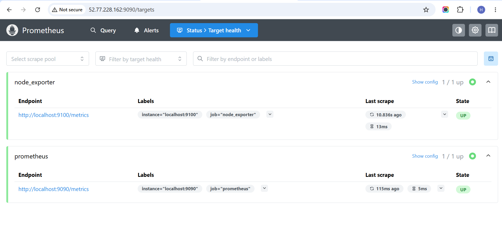
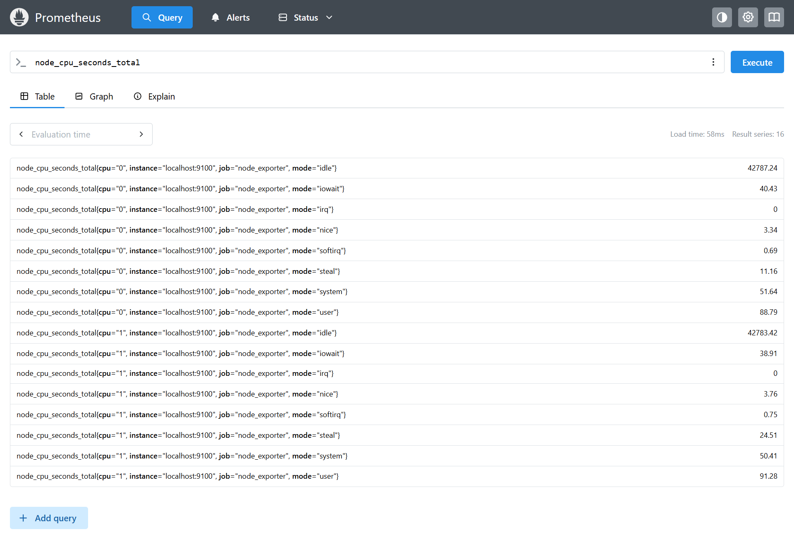

### Node Exporter
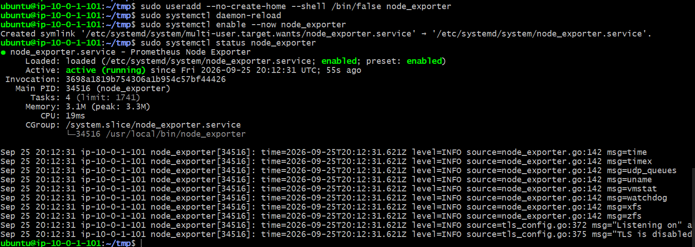
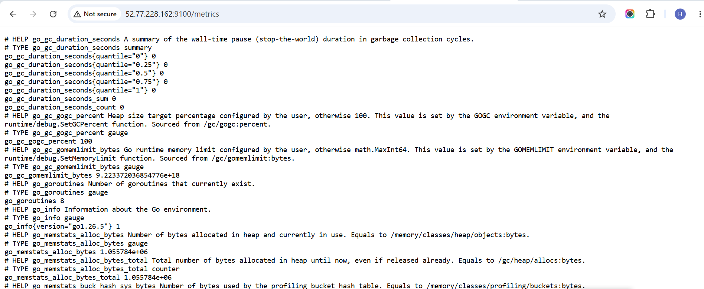

### Grafana
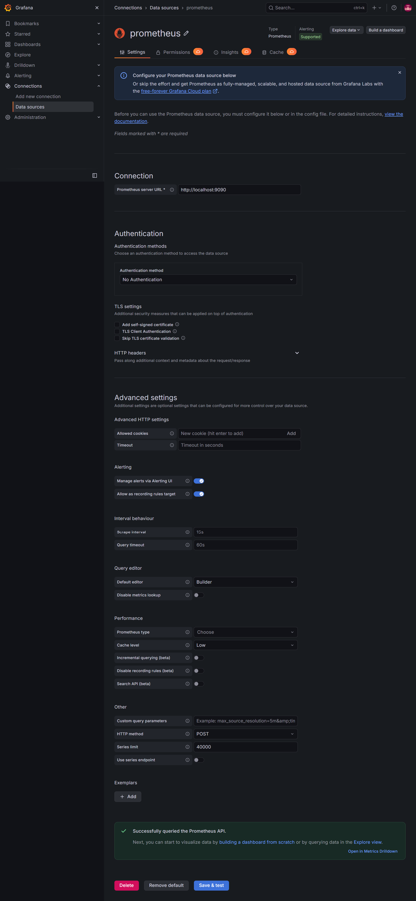
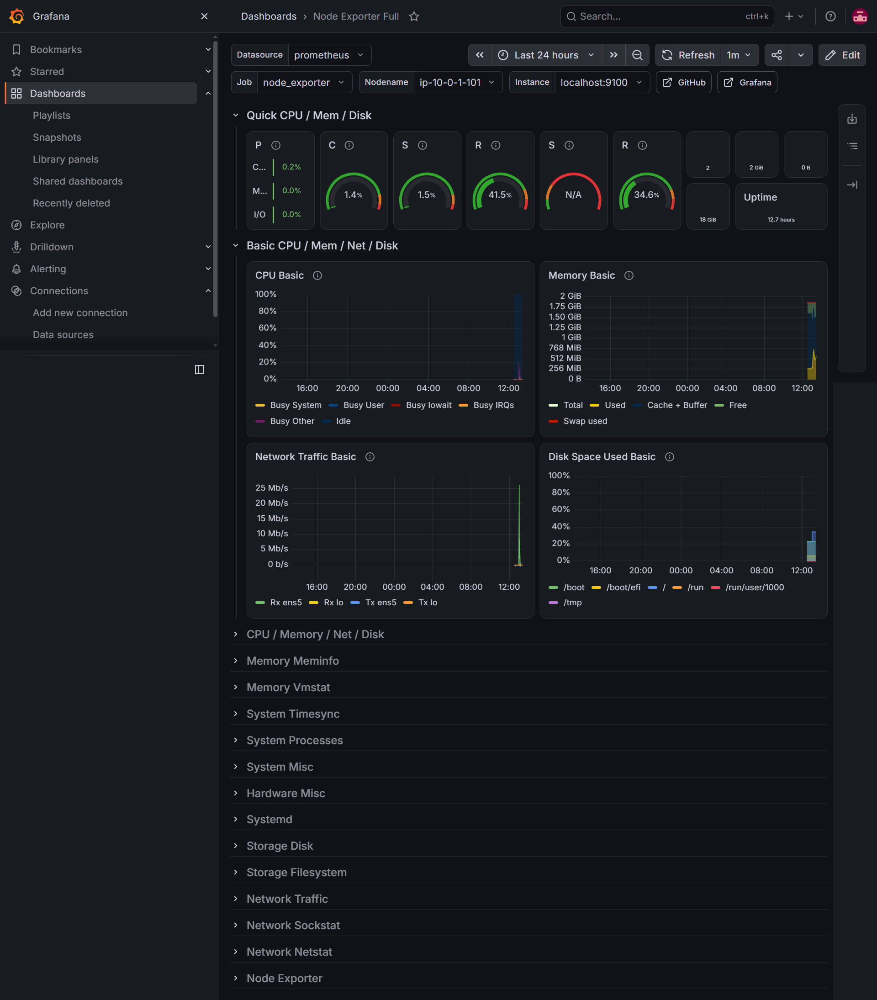
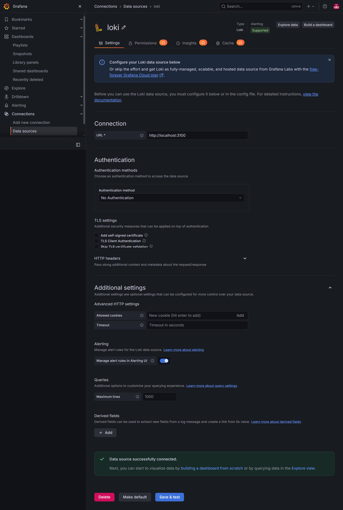
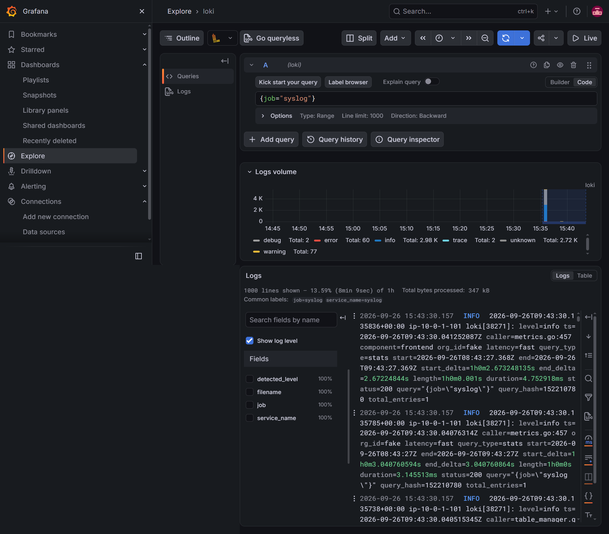

### GitHub Actions
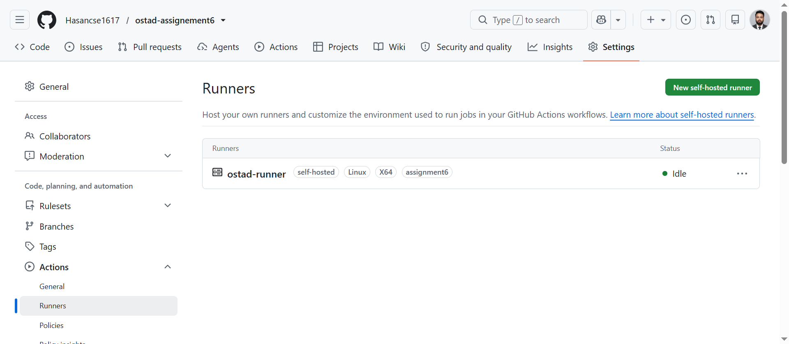
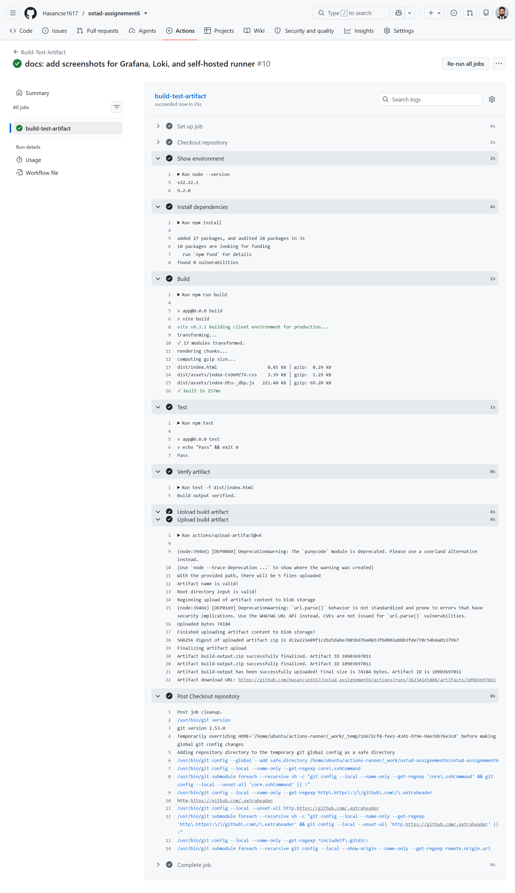
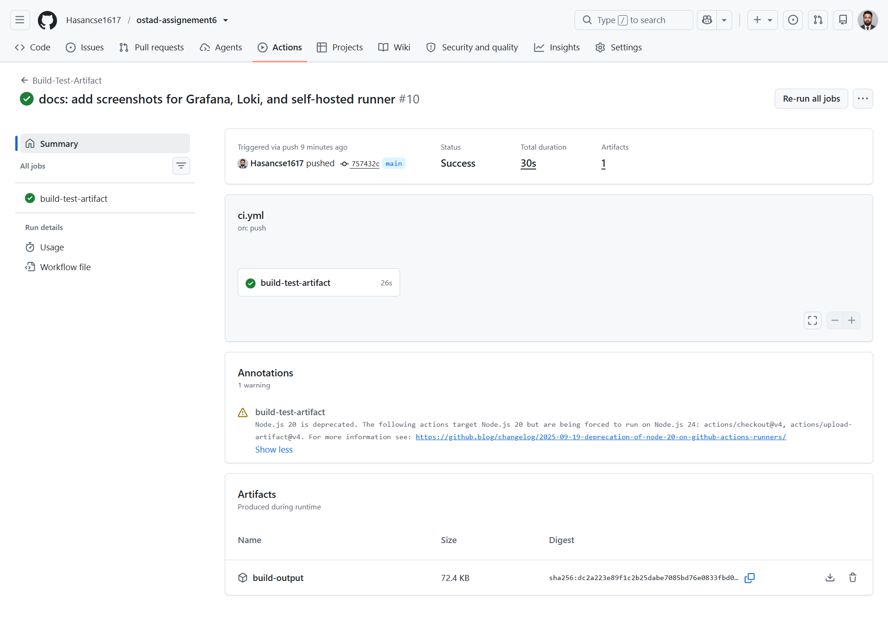
